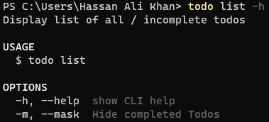

# Project 02 BootCamp 2021: Todo CLI

By doing this project we are able to learn following:-

## Steps to code "Todo CLI"

### 1. Create a basic app using oclif

Create a basic multi command oclif hello world app by using `npx oclif multi todo-cli-hassan`. This will ask for multiple options to complete the package.json file and create the app after successful completion. Delete “src/commands/hello.ts” and update Readme.md to delete un-necessary information.

### 2. Create Data models

Create dataModels folder in the src directory, all the data models are created in this folder. Create todoItem.ts to define TodoItem class which is template for Todo item. Create todoCollection.ts to define TodoCollection class which is a template for collection of todos. In this class create methods for adding new todo to the list, get a todo based on specific id, get list of todos with the option to get complete list or only incomplete todos, mark a todo complete or incomplete based on user selection, remove completed todos from the list and get todos count in the collection which return total, completed and incomplete todos count. Install JSON data base and its types in the project using `npm i lowdb@1.0.0` and `npm i --save-dev @types/lowdb` Create jsonTodoCollection.ts to define a subclass of TodoCollection to store data in the JSON format. This has almost the same methods as in the referring class.

### 3. Create Commands

For creating command use `npx oclif command [command name]`, this will not only create the relevant command file in the commands folder but will also update Readme.md file with relevant information. Install chalk using `npm I chalk` a third-party package to style text in terminal. Create add command which will be used to add a new todo in the list, this command will take new todo as an argument. Install cli-table and its types using `npm i cli-table` and `npm i --save-dev @types/cli-table` to represent todo collection in the tabular form. Create list command to show collection of todos in the terminal, this command will list empty table in-case no todos are present in the collection and in case collection is not empty it displays a complete todo list or the list with only incomplete todos based on flag (-m). Create toggle command to invert complete status of a todo which is determined by the id from the command argument, also implement checks for presence and correct form of argument, presence of todo with specified id and current status of the todo. Create remove command to delete completed todos from the collection. Install inquirer a third-party package to prompt user for inputs during operation by using `npm install inquirer` and inquirer types using `npm i --save-dev @types/inquirer`. Create inquire command which is combination of all other commands with added advantage of user prompting during operation. To use any command use `./bin/run [command name]`. While installing any package will update package.json and package-lock.json. Update .gitignore file to skip "Todo.json" file from tracking as it will change on each operation. Also update Readme.md file to update descriptions for commands.

### 4. Publish App

Published app on npm code as a global package using `npm publish --access public`

## Usage Example

1. Installation

   

2. Version and commands details

   

3. Add command

   

4. List command

   Command details

   

   No todos in the list

   

   Todos in the list

   

5. Toggle command

   Command details

   

   List Conatining completed todos

   

   List with-out completed todos

   

6. Remove command

   Command details

   

7. Inqquire command

   Command details

   

## Reading material

- [oclif: The open CLI Framework](https://oclif.io/)
- [oclif Introduction](https://oclif.io/docs/introduction)
- [Getting started with oclif by creating a todo cli app](https://medium.com/the-z/getting-started-with-oclif-by-creating-a-todo-cli-app-b3a2649adbcf)
- [Todo CLI Repo](https://github.com/dalenguyen/todo-cli)

# todo-cli-hassan

Project 02 BootCamp 2021: Todo CLI

[](https://oclif.io)
[](https://npmjs.org/package/todo-cli-hassan)
[](https://npmjs.org/package/todo-cli-hassan)
[](https://github.com/hassan-ak/todo-cli/blob/master/package.json)

<!-- toc -->

- [todo-cli-hassan](#todo-cli-hassan)
- [Usage](#usage)
- [Commands](#commands)
<!-- tocstop -->

# Usage

<!-- usage -->

```sh-session
$ npm install -g todo-cli-hassan
$ todo COMMAND
running command...
$ todo (-v|--version|version)
todo-cli-hassan/0.0.0 win32-x64 node-v12.17.0
$ todo --help [COMMAND]
USAGE
  $ todo COMMAND
...
```

<!-- usagestop -->

# Commands

<!-- commands -->

- [`todo add [TODO]`](#todo-add-todo)
- [`todo help [COMMAND]`](#todo-help-command)
- [`todo inquire`](#todo-inquire)
- [`todo list`](#todo-list)
- [`todo remove`](#todo-remove)
- [`todo togglestatus [ID]`](#todo-togglestatus-id)

## `todo add [TODO]`

Add new todo to list

```
USAGE
  $ todo add [TODO]

OPTIONS
  -h, --help  show CLI help
```

_See code: [src/commands/add.ts](https://github.com/hassan-ak/todo-cli/blob/v0.0.0/src/commands/add.ts)_

## `todo help [COMMAND]`

display help for todo

```
USAGE
  $ todo help [COMMAND]

ARGUMENTS
  COMMAND  command to show help for

OPTIONS
  --all  see all commands in CLI
```

_See code: [@oclif/plugin-help](https://github.com/oclif/plugin-help/blob/v3.2.2/src/commands/help.ts)_

## `todo inquire`

Use App with user prompting other than Commands

```
USAGE
  $ todo inquire

OPTIONS
  -h, --help  show CLI help
```

_See code: [src/commands/inquire.ts](https://github.com/hassan-ak/todo-cli/blob/v0.0.0/src/commands/inquire.ts)_

## `todo list`

Display list of all / incomplete todos

```
USAGE
  $ todo list

OPTIONS
  -h, --help  show CLI help
  -m, --mask  Hide completed Todos
```

_See code: [src/commands/list.ts](https://github.com/hassan-ak/todo-cli/blob/v0.0.0/src/commands/list.ts)_

## `todo remove`

Remove Completed todos

```
USAGE
  $ todo remove

OPTIONS
  -h, --help  show CLI help
```

_See code: [src/commands/remove.ts](https://github.com/hassan-ak/todo-cli/blob/v0.0.0/src/commands/remove.ts)_

## `todo togglestatus [ID]`

Toolge completion status of a Todo by proving its ID.

```
USAGE
  $ todo togglestatus [ID]

OPTIONS
  -h, --help  show CLI help
```

_See code: [src/commands/togglestatus.ts](https://github.com/hassan-ak/todo-cli/blob/v0.0.0/src/commands/togglestatus.ts)_

<!-- commandsstop -->
